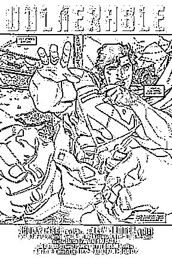

# Example Results

We use two ways to detect the line-arts: threshold (since the line-arts are always close to black) and Laplacian edge detection. Note that: global threshold methods do not work because of the local Hazy effect. So instead, we use Sauvola threshold, which is a local threshold method, to detect the edges.

The example results are shown as the follows. From left to right: Original image, Laplacian edge detection, Sauvola threshold with window size equals to 21, Sauvola threshold with window size equals to 7.

More results are in folder *try*.

                              

